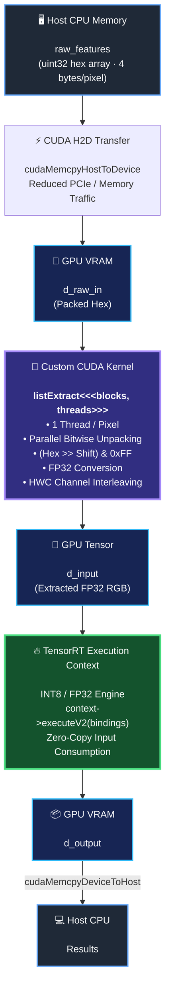

# TensorRT Edge AI One-Image Inferencing Via Native C++ APIs & Benchmark
Edge AI Pipeline: Custom CUDA Pre-processing Kernel &amp; TensorRT Inference via Different Quantization Techniques on Jetson Orin Nano

## Goals & Pre-Conditions
This project aims to classify the images on Edge AI devices, in this case, it is NVIDIA Jetson Orin Nano, analyze the performance across different techniques. Instead of using standard Edge Impulse SDK files, the raw **.tflite** file is converted into device-specific **.engine** file, native CUDA API methods are utilized to enable the GPU cores and accelerate the inferencing process.

## Methodology
**.engine** file includes all the necessary mathematical operation from beginning to producing output classes. The total byte size of the file is calculated with seekg and tellg. By opening a byte vector named engineData, the entire file leaves the disk/SSD and is loaded onto the CPU RAM (Host Memory).

Benefiting from **nvinfer2** class, the file is extracted, deserialized and a engine object is generated into GPU VRAM. The following methods are used to complete those steps:

```cpp
nvinfer1::IRuntime* runtime = nvinfer1::createInferRuntime(gLogger);
nvinfer1::ICudaEngine* engine = runtime->deserializeCudaEngine(engineData.data(), size);
```
It takes this raw binary data (engineData) in the CPU RAM, decodes it, and allocates and loads the weights of the model directly into the GPU VRAM (Device Memory).

```cpp
nvinfer1::IExecutionContext* context = engine->createExecutionContext();
```

It is a dynamic processing manager that allocates the temporary memory area (Scratch Memory / Activation Tensors) needed by the middle layers on the GPU at the time of actual inference.


**bindings[0] (d_input):** Since the engine knows that the first tensor is the input, it reads the bytes at this address and feeds them to the first layer. 

**bindings[1] (d_output):** The engine writes the class probabilities in the last layer of the network to this GPU address. 

**context->executeV2(bindings):** Sends commands to GPU cores; The input is read from the GPU, calculated, and the result is released to the d_output field on the GPU. 

With the last call to **cudaMemcpy(..., d_output, ..., cudaMemcpyDeviceToHost)**, these results are pulled back from the GPU to the CPU.


## Flowchart



## Data Preprocessing Benchmark

Two different approach is followed for preporcessing.

The goal is parse the given HEX Raw Features Array into [R1, G1, B1, R2, G2, B2 ...] format **(Interleaved HWC Format)**.

Firstly, a standard C++ for loop was used to parse the array, after that, another GPU function was defined to process the parsing operation.
The raw data was directly copied into GPU VRAM and the output result was directly given into inference engine in GPU VRAM. Here is the latency analysis for both experiments:

| Implementation | Platform / Execution | Latency | Speedup |
| :--- | :--- | :---: | :---: |
| **CPU Baseline** | Host Thread (`g++ -O2`) | `0.0851 ms` | Reference (1.0x) |
| **Custom CUDA Kernel** | GPU Parallel (`nvcc -O2`) | `0.0205 ms` | **~4.15x Faster** |

---

## TensorRT Engine & Inference Performance

| Metric / Resource | FP16 (Half) | FP32 (Full) | INT8 (Calibrated) |
| :--- | :---: | :---: | :---: |
| **Deserialization Time** | 11.92 ms | 19.53 ms | 13.39 ms |
| **Device Persistent Memory** | 0 B | 154,112 B | 0 B |
| **Host Persistent Memory** | 38,304 B | 36,704 B | 47,632 B |
| **Scratch Memory** | 3.38 MB | 6.66 MB | 1.69 MB |
| **Inference Latency (GPU)** | **1.666 ms** | **2.767 ms** | **0.976 ms** |
| **Accuracy** | Unknown | 96.20% | 94.73% |
| **Weighted F1 Score** | Unknown | 0.96 | 0.95 |
